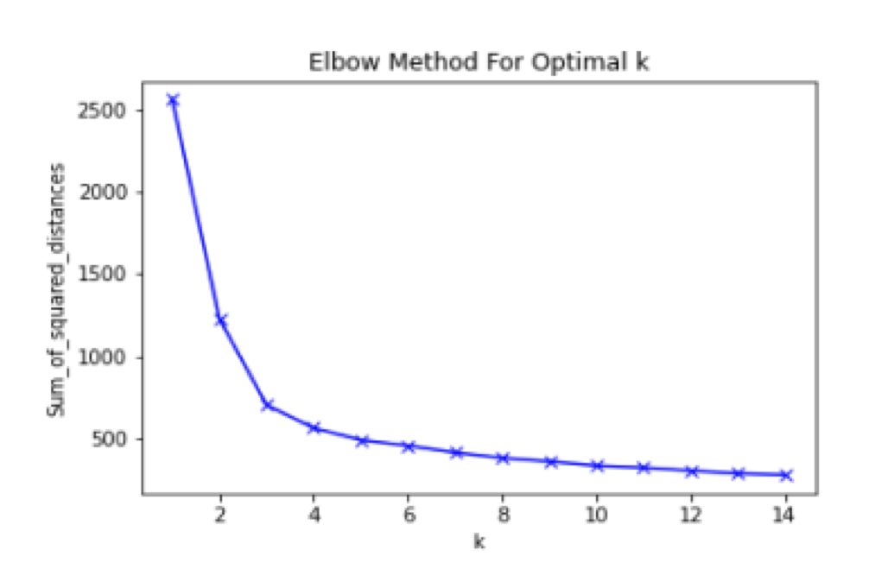

# COMP20008-Classification

COMP20008 Project 2 Part 2: Classification

Marks: 12/13

An exploration of different classification algorithms and feature engineering.

Each year, the World Bank publishes the World Development Indicators which provide high quality and international comparable statistics about global development and the fight against poverty. 

As data scientists, we wish to understand how the information can be used to predict average lifespan in different countries.

All files and source codes are located in the /src folder.

[Project Specification](/proj2_spec.pdf)  

[world.csv (World Development Indicators)](/src/world.csv)  

[life.csv (Life Expectancy)](/src/life.csv)  


## Comparing Classification Algorithms

[Script](/src/task2a.py)

Compare the performance of the following 3 classification algorithms: 

1. k-NN (k=3) 
2. k-NN (k=7) 
3. Decision tree (with a maximum depth of 3)

**Libraries Used**

```python
import pandas as pd
import matplotlib.pyplot as plt
import numpy as np
import csv

from sklearn import neighbors
from sklearn.model_selection import train_test_split
from sklearn.metrics import accuracy_score
from sklearn import preprocessing
from sklearn.tree import DecisionTreeClassifier
```

**Load CSV's**

```python
life=pd.read_csv('life.csv',encoding = 'ISO-8859-1',na_values='..')
world=pd.read_csv('world.csv',encoding = 'ISO-8859-1',na_values='..')

result = pd.merge(life, world, on=['Country Code'])
result = result.sort_values(by='Country Code', ascending = True)
```

**Extract Features and Class Labels**

```python
data=result[['Access to electricity (% of population) [EG.ELC.ACCS.ZS]',
 'Adjusted net national income per capita (current US$) [NY.ADJ.NNTY.PC.CD]',
 'Age dependency ratio (% of working-age population) [SP.POP.DPND]',
 'Cause of death, by communicable diseases and maternal, prenatal and nutrition conditions (% of total) [SH.DTH.COMM.ZS]',
 'Current health expenditure per capita (current US$) [SH.XPD.CHEX.PC.CD]',
 'Fertility rate, total (births per woman) [SP.DYN.TFRT.IN]',
 'Fixed broadband subscriptions (per 100 people) [IT.NET.BBND.P2]',
 'Fixed telephone subscriptions (per 100 people) [IT.MLT.MAIN.P2]',
 'GDP per capita (constant 2010 US$) [NY.GDP.PCAP.KD]',
 'GNI per capita, Atlas method (current US$) [NY.GNP.PCAP.CD]',
 'Individuals using the Internet (% of population) [IT.NET.USER.ZS]',
 'Lifetime risk of maternal death (%) [SH.MMR.RISK.ZS]',
 'People using at least basic drinking water services (% of population) [SH.H2O.BASW.ZS]',
 'People using at least basic drinking water services, rural (% of rural population) [SH.H2O.BASW.RU.ZS]',
 'People using at least basic drinking water services, urban (% of urban population) [SH.H2O.BASW.UR.ZS]',
 'People using at least basic sanitation services, urban (% of urban population) [SH.STA.BASS.UR.ZS]',
 'Prevalence of anemia among children (% of children under 5) [SH.ANM.CHLD.ZS]',
 'Secure Internet servers (per 1 million people) [IT.NET.SECR.P6]',
 'Self-employed, female (% of female employment) (modeled ILO estimate) [SL.EMP.SELF.FE.ZS]',
 'Wage and salaried workers, female (% of female employment) (modeled ILO estimate) [SL.EMP.WORK.FE.ZS]']].astype(float)

classlabel=result['Life expectancy at birth (years)']
```

**Fit and Normalise Models**

For each of the algorithms, a model is fit with the following processing steps:

* Split the dataset into a training set comprising 70% of the data and a test set comprising the remaining 30% using the train test split function with a random state of 200.
* Perform the same imputation and scaling to the training set:

  * For each feature, perform median imputation to impute missing values. 

  * Scale each feature by removing the mean and scaling to unit variance.

* Train the classifiers using the training set.
* Test the classifiers by applying them to the test set.

```python
X_train, X_test, y_train, y_test = train_test_split(data, classlabel, train_size=0.7, test_size=0.3, random_state=200)
X_train = X_train.fillna(X_train.median())
X_test = X_test.fillna(X_train.median())

med = X_train.median()

#normalise the data to have 0 mean and unit variance using the library functions. This will help for later computation of distances between instances
scaler = preprocessing.StandardScaler().fit(X_train)
X_train=scaler.transform(X_train)
X_test=scaler.transform(X_test)
```

**Create CSV**

Create "task2a.csv", describing: 
* median used for imputation for each feature
* mean and variance used for scaling

```python
writerdf=pd.DataFrame({'feature': data.columns, 'median':med,'mean': scaler.mean_,'variance': scaler.var_})
writerdf=writerdf.round(decimals=3)
writerdf.to_csv(r'task2a.csv', index = False)
```

**Outputs Accuracy**

**Decision Tree**

```python
dt = DecisionTreeClassifier(random_state=200, max_depth=3)
dt.fit(X_train, y_train)
y_pred=dt.predict(X_test)
print(f"Accuracy of decision tree: {accuracy_score(y_test, y_pred):.3f}")
```

**K-NN (N=3)**

```python
knn = neighbors.KNeighborsClassifier(n_neighbors=3)
knn.fit(X_train, y_train)
y_pred=knn.predict(X_test)
print(f"Accuracy of k-nn (k=3): {accuracy_score(y_test, y_pred):.3f}")
```

**K-NN (N=7)**

```python
knn = neighbors.KNeighborsClassifier(n_neighbors=7)
knn.fit(X_train, y_train)
y_pred=knn.predict(X_test)
print(f"Accuracy of k-nn (k=7): {accuracy_score(y_test, y_pred):.3f}")
```

**Observation**

For k-nn, k=7 (accuracy of 0.727) performed best, and k=3 (accuracy of 0.673) weaker than k=7. The Decision Tree algorithms performance was weaker than knn=7 but better than knn=3 on this dataset (accuracy of 0.709), hence k-nn performed better, with k=7.

Higher k of k-nn performed better because it is less sensitive to the noises present in the dataset, also k-nn of k=7 performed better than the decision tree since the maximum depth allowed for the decision tree was only 3, thus making it less accurate.

---

## Feature Engineering and Selection

[Script](/src/task2b.py)

In order to achieve higher prediction accuracy for 3-NN, one can investigate the use of feature engineering and selection to predict the class feature of the data. Feature generation involves the creation of additional features. Two possible methods are:

* Interaction term pairs. Given a pair of features *f1* and *f2*, create a new feature *f12* = *f1* × *f2*. All possible pairs can be considered.
* Clustering labels: apply k-means clustering to the data in **world** and then use the resulting cluster labels as the values for a new feature *fclusterlabel*. You will need to decide how many clusters to use. At test time, a label for a testing instance can be created by assigning it to its nearest cluster.

Given a set of N features (the original features plus generated features), feature selection involves selecting a smaller set of n features (n < N).

An alternative method of performing feature engineering & selection is to use **_Principal Component Analysis (PCA)_**. The first n principal components can be used as features.

**Libraries Used**

```python
import pandas as pd
import matplotlib.pyplot as plt
import numpy as np
import csv

from sklearn import datasets, cluster
from sklearn import neighbors
from sklearn.model_selection import train_test_split
from sklearn.metrics import accuracy_score
from sklearn import preprocessing
from sklearn.preprocessing import PolynomialFeatures
from sklearn.tree import DecisionTreeClassifier
from sklearn.feature_selection import chi2
from sklearn.feature_selection import SelectKBest
from sklearn.decomposition import PCA
from sklearn.metrics.cluster import normalized_mutual_info_score
from sklearn.preprocessing import MinMaxScaler
from sklearn.cluster import KMeans

import scipy.stats as stats
from scipy.stats import chi2_contingency
```

**Load CSV's**

```python
life=pd.read_csv('life.csv',encoding = 'ISO-8859-1',na_values='..')
world=pd.read_csv('world.csv',encoding = 'ISO-8859-1',na_values='..')

result = pd.merge(life, world, on=['Country Code'])
result = result.sort_values(by='Country Code', ascending = True)
```

**Extract Features and Class Labels**

```python
data=result[['Access to electricity (% of population) [EG.ELC.ACCS.ZS]',
 'Adjusted net national income per capita (current US$) [NY.ADJ.NNTY.PC.CD]',
 'Age dependency ratio (% of working-age population) [SP.POP.DPND]',
 'Cause of death, by communicable diseases and maternal, prenatal and nutrition conditions (% of total) [SH.DTH.COMM.ZS]',
 'Current health expenditure per capita (current US$) [SH.XPD.CHEX.PC.CD]',
 'Fertility rate, total (births per woman) [SP.DYN.TFRT.IN]',
 'Fixed broadband subscriptions (per 100 people) [IT.NET.BBND.P2]',
 'Fixed telephone subscriptions (per 100 people) [IT.MLT.MAIN.P2]',
 'GDP per capita (constant 2010 US$) [NY.GDP.PCAP.KD]',
 'GNI per capita, Atlas method (current US$) [NY.GNP.PCAP.CD]',
 'Individuals using the Internet (% of population) [IT.NET.USER.ZS]',
 'Lifetime risk of maternal death (%) [SH.MMR.RISK.ZS]',
 'People using at least basic drinking water services (% of population) [SH.H2O.BASW.ZS]',
 'People using at least basic drinking water services, rural (% of rural population) [SH.H2O.BASW.RU.ZS]',
 'People using at least basic drinking water services, urban (% of urban population) [SH.H2O.BASW.UR.ZS]',
 'People using at least basic sanitation services, urban (% of urban population) [SH.STA.BASS.UR.ZS]',
 'Prevalence of anemia among children (% of children under 5) [SH.ANM.CHLD.ZS]',
 'Secure Internet servers (per 1 million people) [IT.NET.SECR.P6]',
 'Self-employed, female (% of female employment) (modeled ILO estimate) [SL.EMP.SELF.FE.ZS]',
 'Wage and salaried workers, female (% of female employment) (modeled ILO estimate) [SL.EMP.WORK.FE.ZS]']].astype(float)

classlabel=result['Life expectancy at birth (years)']
```

**Fit and Normalise Models**

```python
X_train, X_test, y_train, y_test = train_test_split(data, classlabel, train_size=0.7, test_size=0.3, random_state=200)
X_train = X_train.fillna(X_train.median())
X_test = X_test.fillna(X_train.median())
med = X_train.median()

#normalise the data to have 0 mean and unit variance using the library functions.  This will help for later
#computation of distances between instances
scaler = preprocessing.StandardScaler().fit(X_train)
X_train=scaler.transform(X_train)
X_test=scaler.transform(X_test)
```

**Determining the Number of Clusters**

To find the number of clusters to use for clustering labels (using k-means algorithm), the Elbow Method was adopted. 

After splitting the dataset, performing mean imputation and normalisation, the k-means algorithm (KMeans from sklearn) was used on the training set on range k from 1 to 15, and the sum of squared distances was calculated and plotted against k. 

Upon examining the plot, we could see that the elbow point as located at k=3, where the rate of decrease of the sum of squared distances significantly dropped. 

Thus, we conclude that k=3 is the optimal value for the number of clusters used on the k- means algorithm.



```python
Sum_of_squared_distances = []
K = range(1,15)
for k in K:
    km = KMeans(n_clusters=k)
    km = km.fit(X_train)
    Sum_of_squared_distances.append(km.inertia_)
    
plt.plot(K, Sum_of_squared_distances, 'bx-')
plt.xlabel('k')
plt.ylabel('Sum_of_squared_distances')
plt.title('Elbow Method For Optimal k')
plt.savefig("task2bgraph1.png")
plt.show()
```

**Feature Engineering Using Interaction Term Pairs**

We first generated 1 cluster label for both testing and training sets (f clusterlabel) using k-means clustering trained by the training set (KMeans from sklearn,k=3), and we assigned each instance to the nearest cluster (0,1 or 2). 

Using _PolynomialFeatures_ , 190 features were generated by all possible interaction term pairs from the original dataset. 

Combining the original features, feature by clustering, and the interaction term pair features, we calculate and obtain 4 features of highest Normalised Mutual Information using _normalized_mutual_info_score_.

NMI was used since the chi-square feature on sklearn does not work well with negative numbers which were present in the dataset. 

NMI calculates the correlation of the feature and the class, so it is a good parameter to help us with selecting the best 4 features to predict the life expectancy.

```python
poly = PolynomialFeatures(2, include_bias=False, interaction_only=True)
poly.fit(X_train)
X_train_1=poly.transform(X_train)
X_test_1=poly.transform(X_test)

print("First five rows of the 190 features generated using interaction term pairs")
print(pd.DataFrame(X_train_1).iloc[:,20:].head(5))
print("\n")
print("First five rows of the 1 feature generated by clustering")
print(pd.DataFrame(f_cluster_train).head(5))
 

X_train_1 = np.concatenate((X_train_1,f_cluster_train[:,None]), axis=1)
X_test_1 = np.concatenate((X_test_1,f_cluster_test[:,None]), axis=1)

print("\n")
print("First five rows of the 211 features from interaction pairs and clustering before feature selection")
print(pd.DataFrame(X_train_1).head(5))

dep_features = []
for feature in range(0,211):
    x_val = X_train_1[:,feature]
    nmi = normalized_mutual_info_score(x_val, y_train)
    dep_features.append([feature, nmi]) 
dep_features = sorted(dep_features, key=lambda x: x[1], reverse = True)

top_features = []
print("\n")
print("Top 4 features with highest NMI: ")
for feature in dep_features[:4]:
    print("feature:",feature[0])
    print("nmi:",feature[1])
    top_features.append(feature[0])
X_train_1 = X_train_1[:,top_features]
X_test_1 = X_test_1[:,top_features]

print("\n")
print("First five rows of the 4 feature selected from 211 features")
print(pd.DataFrame(X_train_1).head(5))

knn = neighbors.KNeighborsClassifier(n_neighbors=3)
knn.fit(X_train_1, y_train)
y_pred_1=knn.predict(X_test_1)
```

**Feature Engineering Using PCA**

The model was first created and trained by the training set (using n- components = 4) and transformed the training and testing sets into 4 sets of features for classification. 

```python
pca = PCA(n_components=4)
pca.fit(X_train)
X_train_2=pca.transform(X_train)
X_test_2=pca.transform(X_test)

print("\n")
print("First five rows of the 4 features generated by PCA")
print(pd.DataFrame(X_train_2).head(5))

knn = neighbors.KNeighborsClassifier(n_neighbors=3)
knn.fit(X_train_2, y_train)
y_pred_2=knn.predict(X_test_2)
```

**Feature Engineering Using First 4 Features**

For the final approach, the first 4 features from the dataset were sliced and used to train and test the k-nn classifier as before.

```python
knn = neighbors.KNeighborsClassifier(n_neighbors=3)
X_train_3=X_train[:,range(4)]
X_test_3=X_test[:,range(4)]
knn.fit(X_train_3, y_train)
y_pred_3=knn.predict(X_test_3)

print("First five rows of the 4 features generated by taking first 4 features")
print(pd.DataFrame(X_train_3).head(5))
```

**Print out Accuracy Scores**

```python
print(f"Accuracy of feature engineering: {accuracy_score(y_test, y_pred_1):.3f}")
print(f"Accuracy of PCA: {accuracy_score(y_test, y_pred_2):.3f}")
print(f"Accuracy of first four features: {accuracy_score(y_test, y_pred_3):.3f}")
```

**Observation**

Generally, the scores vary a bit when using different random states for splitting. 

However, the PCA method generally yielded the best results for classification using 3-NN (accuracy = 0.727). This is because the principal component analysis is effective with high dimensional data. It was able to extract the top 4 features from "world.csv" with the highest variability and reduced the dimension significantly while still providing good precision as from the original set. 

On the other hand, using interaction term pairs was less effective since multiplying different world development indicators was unlikely to generate any contextually useful information. 

Clustering labels using k-means were also unable to perform well on clusters of different sizes and density in the dataset. Hence, using the combination of both of these result labels gave the lowest accuracy scores for 3- NN classification (accuracy = 0.582) which was even lower than just simply taking the first 4 columns of the original feature, which at least still preserves some accuracy from the original dataset (accuracy = 0.636).

To improve the performance of the model, we could try varying splitting proportions for out testing and training sets and choosing one that's not too high nor too low but still better for our accuracy. 

We could also use some domain knowledge on World Development Indicators and average lifespan to remove some similar or irrelevant features or features in a causal relationship, or select features of interest for classification. 

We could also then generate some linear weighted combination of features of interest (using domain knowledge) to help with the accuracy.


**Conclusion**

I would say that my classification model is rather reliable. 

This is because the accuracy scores generated were quite satisfactory for most of the methods (PCA most reliable with 0.727 accuracy, and feature selection from 211 features least reliable with 0.582 accuracy). 

The data was split in a way that the proportion was reasonable. Median imputation was also performed based on the training data, and testing data was also normalised according to the training data. The testing sets were completely isolated from the training sets, meaning that the models were built solely on the training sets and completely independent of the testing sets. 

Informed choices on feature filtering were also made based on a standard parameter like NMI, and the elbow method on the number of clusters for k-means algorithm.